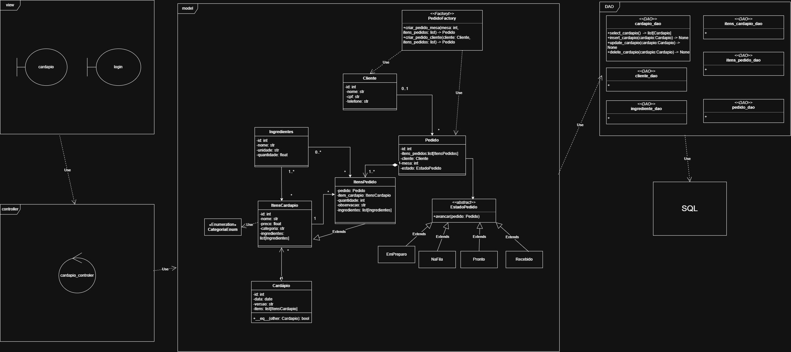
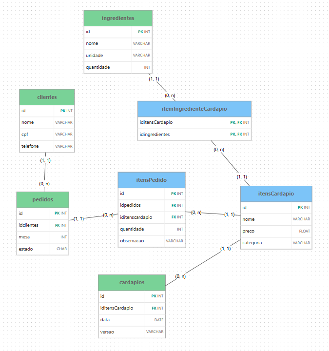

# Descrição do projeto
Este projeto consiste no desenvolvimento de um sistema de uma lanchonete, tendo como prioridade gerenciar o comércio. O objetivo principal é ter um acesso eficiente ao cardápio e a relação entre cliente e sua compra, podendo facilmente gerenciar esses dados

- Projetista: Tarcísio Luiz Harres de Almeida (tarcisiolh)
- Banco/Desenvolvimento: Victor Antônio Galvan (VictorAGalvan)
- Banco/Desenvolvimento: Rafael Albuquerque de Paula (Rafael-Dpaula)

# Diagrama de Classes

> UML

# Diagrama de Classes

> UML

# Modelo Lógico do Banco de Dados

> LOGIC MODEL

---