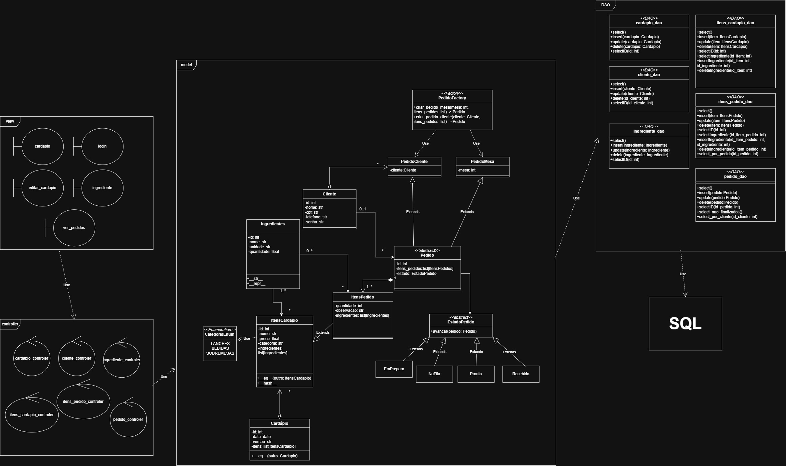
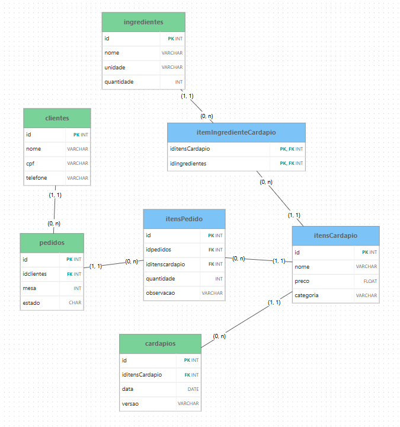

# Descrição do projeto
Este projeto consiste no desenvolvimento de um sistema de uma lanchonete, tendo como prioridade gerenciar o comércio. O objetivo principal é ter um acesso eficiente ao cardápio e a relação entre cliente e sua compra, podendo facilmente gerenciar esses dados

- Projetista: Tarcísio Luiz Harres de Almeida (tarcisiolh)
- Banco/Desenvolvimento: Victor Antônio Galvan (VictorAGalvan)
- Banco/Desenvolvimento: Rafael Albuquerque de Paula (Rafael-Dpaula)
# Documentação Técnica — Sistema de Gerenciamento de Lanchonete
 
## 1. Objetivo do sistema
 
O sistema gerencia pedidos de uma lanchonete. Ele tem três perfis de uso: cliente, garçom/admin no balcão, e admin gerenciando o cardápio. O sistema usa uma interface gráfica feita em Tkinter e persiste os dados em um banco PostgreSQL (ou, opcionalmente, em memória, usando uma branch separada com dados mock).
 
## 2. Arquitetura
 
### 2.1. Arquitetura em camadas inspirada em MVC
 
O projeto tenta replicar as ideias do MVC (Model-View-Controller) dentro de uma arquitetura em camadas. A escolha faz sentido para o tamanho do projeto: o sistema não é extremamente complexo, mas tem volume de dados e de classes suficiente para exigir mais organização do que um único arquivo monolítico.
 
As camadas são:
 
- **Views** (`views/`): telas Tkinter. Criam os widgets, coletam entradas, exibem erros e resultados e encaminham eventos aos controllers de fluxo. Não acessam o banco nem aplicam regras de negócio diretamente.
- **Controllers** (`controler/`): fazem a ponte entre View, Model e DAO. Os controllers de fluxo (`login_controller.py`, `cardapio_view_controller.py`, `pedidos_view_controller.py`, `ingredientes_view_controller.py`, `cardapio_admin_controller.py` e `app_controller.py`) concentram validações, regras de negócio, navegação de sessão e operações do caso de uso; os controllers existentes por entidade encaminham as operações aos DAOs.
- **Models** (`models/`): classes de domínio puras (Pedido, ItensCardapio, Cliente, etc.), sem lógica de acesso a dados.
- **DAOs** (`dao/`): responsáveis pela leitura e escrita, seja em banco SQL, seja em memória (mock).
Essa divisão não é o MVC "de livro" (não há notificação automática de eventos entre Model e View, por exemplo). É uma arquitetura em camadas que reaproveita a separação de responsabilidades do MVC: Model guarda o estado do domínio, View mostra e recebe entrada do usuário, Controller decide o que fazer.
 
### 2.2. Padrão DAO (Data Access Object)
 
Cada entidade do domínio tem um DAO próprio (`ClienteDAO`, `PedidoDAO`, `ItensCardapioDAO`, etc.), com uma interface fixa: `select`, `selectID`, `insert`, `update`, `delete`, além de métodos específicos (`select_por_cardapio`, `select_nao_finalizados`, etc.).
 
O projeto tem duas implementações completas dessa interface:
 
- **Versão SQL** (branch `main`): usa SQLAlchemy sobre PostgreSQL.
- **Versão mock** (branch `add/interface`): guarda os dados em listas Python, em memória.
As duas implementações expõem os mesmos métodos. Isso permite trocar de uma para outra sem alterar Controller nem View — só o `import` do DAO muda. Essa é a vantagem central do padrão DAO/Repository: isolar o resto do sistema de como e onde os dados são guardados.
 
## 3. Fluxos principais (os três botões)
 
### 3.1. Ver Cardápio → Fazer Pedido
 
1. A tela `Cardapio` solicita ao `CardapioViewController` os itens do cardápio marcado como ativo.
2. O usuário escolhe quantidade de cada item, com botões "+" e "-".
3. Ao clicar em "Info", abre-se `ItensDetail`, onde o usuário marca quais ingredientes quer manter (desmarcando os que não quer) e escreve uma observação.
4. Ao clicar em "Fazer Pedido":
   - Se o acesso for de admin/garçom, o sistema pede o número da mesa.
   - Se o acesso for de cliente autenticado, o sistema usa o cliente logado, sem pedir mesa.
5. O `CardapioViewController` valida os dados do pedido e usa a `PedidoFactory` para instanciar `PedidoMesa` ou `PedidoCliente`.
6. O `PedidoControler` grava o pedido e os itens no banco, através do `PedidoDAO`.
### 3.2. Ver Pedidos → Avançar estado
 
1. A tela `Pedidos` lista, via `PedidoControler`, todos os pedidos cujo estado ainda não é "Pronto".
2. Cada linha tem um botão "Detalhes" (mostra os itens do pedido) e um botão "Avançar" (só visível/habilitado para o admin).
3. Ao clicar em "Avançar", o pedido chama `estado.avancar(pedido)`. O objeto de estado atual decide qual é o próximo estado e troca `pedido.estado` por uma nova instância.
4. Quando o pedido chega a "Pronto", o botão "Avançar" é removido da tela.
### 3.3. Editar Cardápio
 
1. A tela `ListaCardapios` mostra todos os cardápios (versões) cadastrados, com a versão ativa marcada.
2. O admin pode marcar outro cardápio como ativo (`tornar_ativo`), o que desmarca automaticamente o anterior.
3. Ao editar um cardápio, o admin vê a lista de itens daquela versão específica, podendo editar nome/preço/categoria, adicionar item novo, ou remover.
## 5. Padrões de projeto usados
 
### 5.1. Factory Method — `PedidoFactory`
 
**Problema:** um pedido pode ser feito por um cliente autenticado ou anotado por um garçom em uma mesa. As duas situações têm dados quase idênticos (itens, quantidade, observação, ingredientes), diferindo apenas em quem fez o pedido (cliente ou mesa).
 
**Solução:** `PedidoFactory` decide, a partir dos parâmetros recebidos, se instancia `PedidoMesa` ou `PedidoCliente` — duas subclasses de `Pedido`. Isso evita que a View precise conhecer os detalhes de construção de cada tipo de pedido; ela só chama o método certo da fábrica.
 
**Por que não usamos herança/composição direta em `ItensPedido`/`ItensCardapio`:** `ItensPedido` é uma especialização de `ItensCardapio` (herda id, nome, preço, categoria, ingredientes) e acrescenta apenas quantidade e observação. Um `ItensPedido` só existe se houver um `ItensCardapio` correspondente, com os mesmos dados base. Por isso optamos por herança direta ali, em vez de outro padrão — não havia variação de tipo a abstrair, só reaproveitamento de dados.
 
### 5.2. State — `EstadoPedido` e subclasses
 
**Problema:** um pedido passa por estados sequenciais (Recebido → Na Fila → Em Preparo → Pronto), e cada estado só pode avançar para o seguinte, nunca voltar ou pular. Fazer isso com condicionais (`if estado == "recebido": ...`) cresce em complexidade a cada novo estado.
 
**Solução:** cada estado é uma classe própria, com um método `avancar(pedido)` que sabe para qual próximo estado o pedido deve ir. O objeto `Pedido` guarda uma referência ao estado atual e delega a ele a decisão de avançar. Isso concentra a lógica de transição em um lugar por estado, em vez de espalhar condicionais pelo sistema.
 
### 5.3. DAO / Repository
 
Já descrito na seção 2.2. Não estava no escopo original da explicação sobre padrões de projeto, mas é um padrão presente e relevante — a interface fixa entre DAO mock e DAO SQL é o que permite duas branches do projeto (com banco e sem banco) compartilharem toda a lógica de Controller e View.
 
## 6. Decisões de modelagem de dados
 
### 6.1. Cardápio ativo
 
A tabela `cardapios` tem uma coluna `ativo` (booleano). Apenas um cardápio pode estar ativo por vez — essa regra é garantida pelo `CardapioDAO.set_ativo()`, que desmarca todos os cardápios antes de marcar o escolhido. É a versão ativa que aparece para o cliente na tela "Ver Cardápio".
 
### 6.2. Item de cardápio pertence a um único cardápio
 
A chave estrangeira está em `itensCardapio.idcardapio` (não o inverso). Isso significa que cada versão do cardápio tem sua própria cópia de cada item — o "X-Burguer" da versão 1.0 e o "X-Burguer" da versão 3.0 são registros diferentes no banco, mesmo tendo o mesmo nome. Essa decisão evita que editar um item em uma versão do cardápio afete outras versões.
 
### 6.3. Duas tabelas de junção para ingredientes
 
- `itemIngredienteCardapio`: liga um item do cardápio aos ingredientes da receita padrão.
- `itemIngredienteItensPedido`: liga um item de um pedido específico aos ingredientes que o cliente escolheu manter naquele pedido.
Essa separação existe porque a personalização feita por um cliente em um pedido (por exemplo, remover cebola) não pode alterar a receita padrão do prato no cardápio.
 
## 7. Trabalhos futuros
 
- Reforçar a camada de segurança do cadastro de clientes.
- Avaliar a inclusão de padrões de projeto adicionais, o que exige uma reestruturação maior do código e fica para uma próxima iteração, conforme o tempo permitir.
- Investir em uma interface gráfica mais amigável para o usuário final.
## 8. Como usar o projeto
 
### 8.1. Com banco de dados (branch `main`)
 
1. Configure os parâmetros de conexão em `database/conexao.py` (usuário, senha, host, porta, nome do banco).
2. Execute `database/bd.sql` no seu PostgreSQL para criar as tabelas.
3. Execute `database/insertions.sql` para popular o banco com dados de exemplo.
4. Na raiz do projeto, rode:
```
   python app.py
```
 
### 8.2. Sem banco de dados (branch `add/interface`)
 
1. Rode `git checkout add/interface`.
2. Os DAOs passam a usar listas em memória (mock) em vez do banco.
3. Na raiz do projeto, rode:
```
   python app.py
```
 
## 9. Organização do repositório
 
O projeto usa branches para separar a versão com persistência real (SQL, branch `main`) da versão de demonstração sem banco (mock, branch `add/interface`). Essa separação permite testar a interface e o fluxo de uso sem depender de configuração de banco de dados.
 
# Diagrama de Classes

> UML



# Modelo Lógico do Banco de Dados

> LOGIC MODEL





---
